# EIBE SCM Platform

> 엑셀과 이메일로 흩어져 있던 **발주 → 해상운송 → 입고 → 재고 → 판매** 데이터를 하나의 판매 원장으로 모으고,
> **사칙연산만으로 근거가 드러나는 통계**로 발주·이관·유통기한 판단을 돕는 사내 SCM 플랫폼.

<p align="center">
  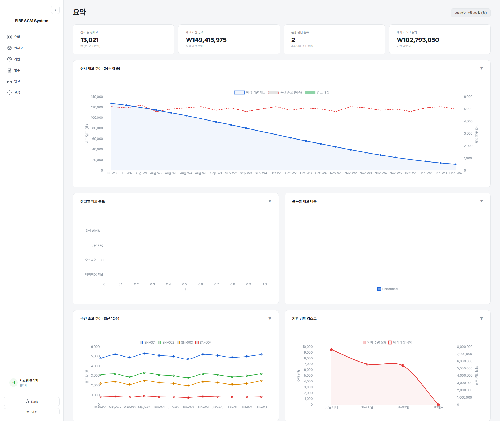
</p>

---

## 목차

1. [한눈에 보기](#1-한눈에-보기)
2. [왜 만들었나](#2-왜-만들었나)
3. [진행 상황 — v1에서 v2로](#3-진행-상황--v1에서-v2로)
4. [화면 (v1)](#4-화면-v1)
5. [주요 기능](#5-주요-기능)
6. [아키텍처](#6-아키텍처)
7. [데이터 모델](#7-데이터-모델)
8. [핵심 로직 흐름](#8-핵심-로직-흐름)
9. [API](#9-api)
10. [설계 결정](#10-설계-결정)
11. [품질 관리](#11-품질-관리)
12. [실행 방법](#12-실행-방법)
13. [알려진 문제와 로드맵](#13-알려진-문제와-로드맵)
14. [문서 지도](#14-문서-지도)

---

## 1. 한눈에 보기

| 항목 | 내용 |
|---|---|
| 사용자 | 사내 SCM·영업 실무자. 권한 3단계 (관리자 / 운영자 / 조회자) |
| 해결하는 문제 | 엑셀 수기 매칭, 감에 의존한 발주, 같은 판매 데이터를 두 앱이 따로 들고 있던 구조 |
| 핵심 기능 | 재고일수 히트맵 · 24주 재고 시뮬레이션과 발주 제안 · FEFO 유통기한 위험 판정 · HUB→풀필먼트 이관 제안 · 매출 대시보드 · 엑셀 양식 7종 업로드 |
| 설계 원칙 | 동기화 대신 파생 · 머신러닝 없이 설명 가능한 통계 · 인증이 기본값 · 빌드 없는 프론트엔드 · SQLite↔PostgreSQL 무비용 전환 |
| 스택 | Python 3.12, FastAPI, SQLAlchemy 2, Alembic, Pydantic 2, SQLite(WAL)→PostgreSQL, openpyxl, PyJWT, bcrypt, Vanilla JS, Chart.js |
| 규모 (v2 `eibe/`) | 애플리케이션 8,281줄 · 테스트 4,795줄 (385개) · API 61개 · 테이블 14개 · 마이그레이션 2건 |
| 상태 | v1 화면 7개 동작 · v2 백엔드 Phase 4까지 완료, 프론트엔드 통합(Phase 5) 예정 |

---

## 2. 왜 만들었나

**문제 1 — 엑셀과 감에 의존한 공급망 관리.**
발주·생산·인보이스·입고 정보가 엑셀 파일로 메일을 오갔고, 담당자가 손으로 맞춰 봤다. 데이터가 흩어져 있으니
"이 품목이 몇 주 버티는가"를 바로 답할 수 없었고, 결과는 품절과 악성 재고, 유통기한 폐기였다.

**문제 2 — 같은 사실을 두 앱이 따로 보관.**
사내에는 재고·발주를 보는 **SCM 대시보드**와 매출을 보는 **Sales Hub**(순수 JS 약 8천 줄, 엑셀 시트를 배열 그대로 저장)가
따로 있었다. 둘 다 "판매"를 다루지만 저장소가 달라, 합치려면 양방향 동기화가 필요했다.

**문제 3 — v1이 남긴 구조적 부채.**
v1은 PC 한 대에서 혼자 쓰는 것을 전제로 빠르게 만들었다. 그래서 시크릿 하드코딩, 서버 기동 시 `admin/admin` 자동 생성,
무인증 조회 API, `Float` 금액, `Text` 날짜, 대문자 테이블명, `create_all()` 스키마 관리가 남아 있었다.

**해결 방향.** 두 앱을 하나의 DB로 합쳐 **판매 원장 하나에서 SCM 지표를 파생**시킨다. 동기화할 대상 자체를 없앤다.
예측은 실무자가 손으로 따라갈 수 있는 사칙연산 통계로만 한다.

---

## 3. 진행 상황 — v1에서 v2로

| 구분 | 위치 | 기간 | 내용 |
|---|---|---|---|
| v1 SCM Dashboard | `app/`, `web/` | 2026-06 ~ 07 | FastAPI + SQLite + 순수 HTML/JS 화면 7개. 현재 스크린샷의 화면 |
| Sales Hub 보존본 | `sales code/` | — | 구 매출 대시보드 원본. 포팅 참고용 (Salesforce 아님) |
| **v2 통합 플랫폼** | **`eibe/`** | 2026-08 ~ | 두 앱을 하나로 재구축. 완료 후 루트로 승격하고 v1·Sales Hub 폐기 |

### v2 로드맵

| Phase | 내용 | 상태 | 커밋 |
|---|---|---|---|
| 0 | 안전망 — Sales Hub 원본 커밋 | 완료 | `2c05615` |
| 1 | 골격 — 설정 · DB · Alembic · 쿠키 인증 | 완료 | `2e4a82e` |
| 2 | 통합 도메인 모델 (테이블 14개) | 완료 | `297d44a` |
| 3a | 예측(forecasting) · 파생 집계(derive) | 완료 | `2ed69af` |
| 3b | 매출 분석 포팅(analytics) · 엑셀 서비스 | 완료 | `c98646f` |
| 4a | 기준 정보 · 사용자 API | 완료 | `677b30d` |
| 4b | 재고 · 유통기한 · 이관 · 발주 계획 API | 완료 | `b1cf54d` |
| 4c | 판매 · 매출 대시보드 · 엑셀 업로드 API | 완료 (테스트 5건 실패, [13절](#13-알려진-문제와-로드맵)) | `847896c` |
| 5 | 프론트엔드 통합 (네이티브 ES Module) | 예정 | |
| 6 | 시딩 · 테스트 마무리 | 예정 | |
| 7 | 루트 승격 · 구 코드 폐기 · 문서 개정 | 예정 | |

테스트 현황: **385개 중 380개 통과** (2026-10-08 측정, `eibe/`에서 `python -m pytest`).

---

## 4. 화면 (v1)

<table>
  <tr>
    <td align="center"><strong>로그인</strong></td>
    <td align="center"><strong>대시보드</strong></td>
  </tr>
  <tr>
    <td>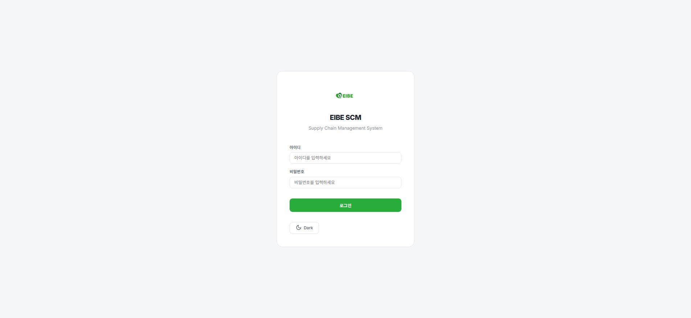</td>
    <td></td>
  </tr>
  <tr>
    <td align="center"><strong>재고 현황</strong></td>
    <td align="center"><strong>유통기한 관리</strong></td>
  </tr>
  <tr>
    <td>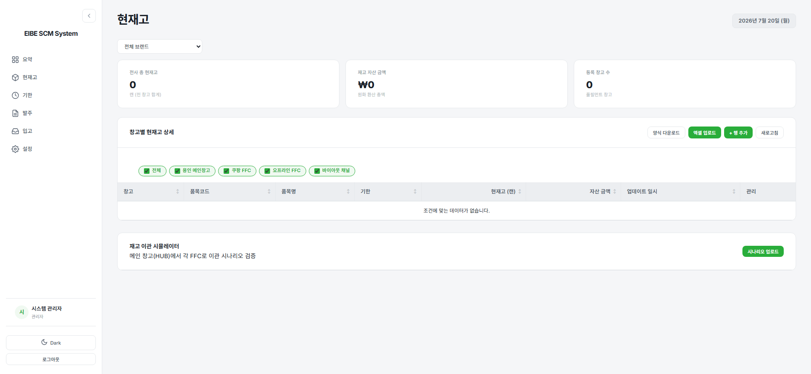</td>
    <td>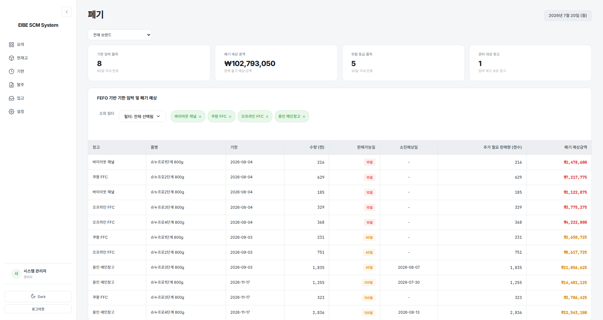</td>
  </tr>
  <tr>
    <td align="center"><strong>발주 계획</strong></td>
    <td align="center"><strong>입고 관리</strong></td>
  </tr>
  <tr>
    <td>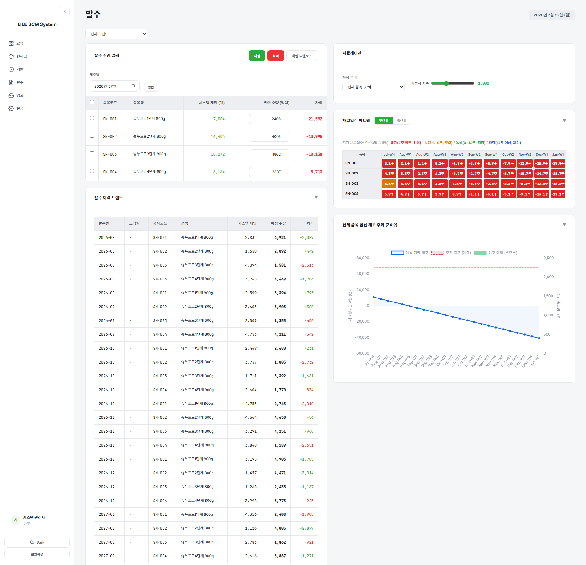</td>
    <td>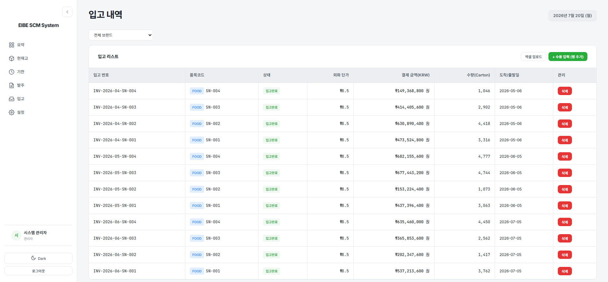</td>
  </tr>
  <tr>
    <td align="center"><strong>설정</strong></td>
    <td align="center"><strong>다크 모드</strong></td>
  </tr>
  <tr>
    <td>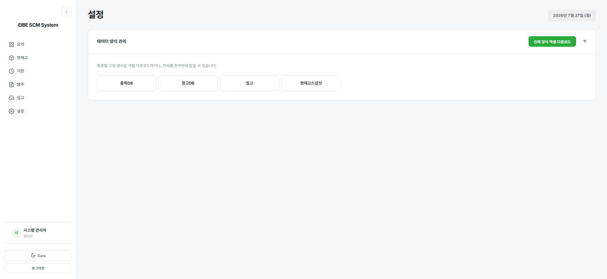</td>
    <td>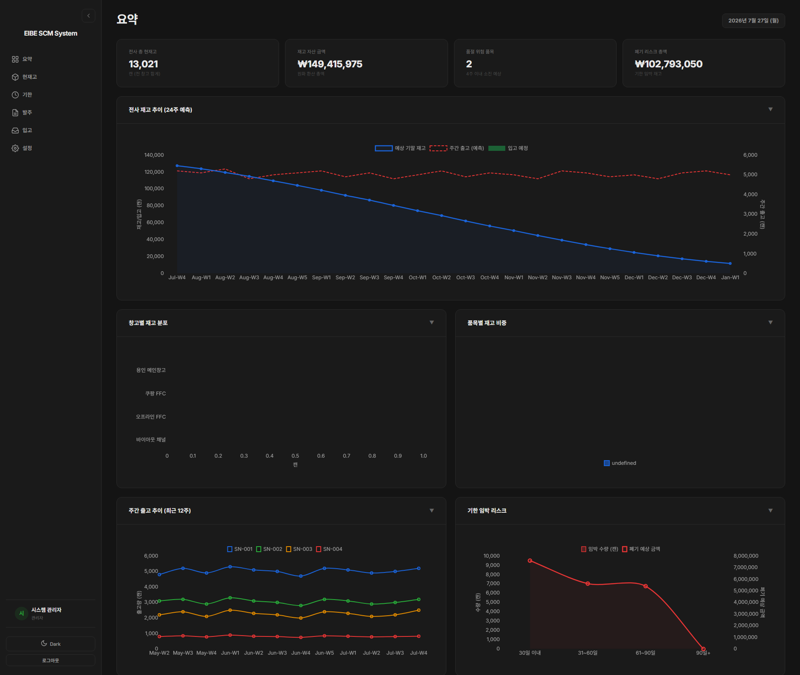</td>
  </tr>
</table>

<p align="center">
  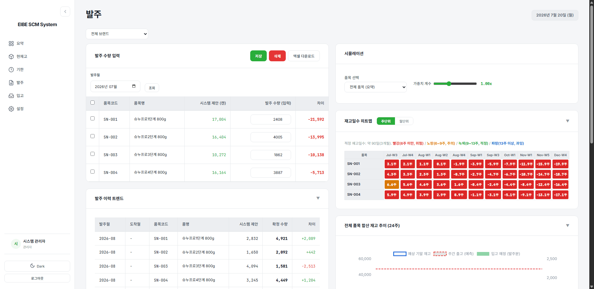
  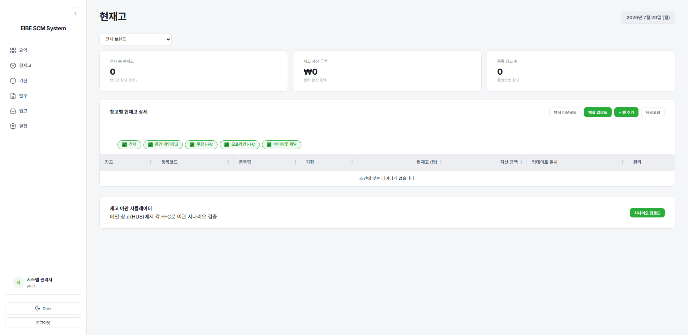
</p>

수량이나 가중치를 바꾸면 버튼 없이 재고일수 색과 차트가 즉시 바뀐다. 클라이언트에서 끝나는 계산에 "실행" 버튼을 두지 않는다.

---

## 5. 주요 기능

| 기능 | 하는 일 | 핵심 규칙 | 코드 (v2) |
|---|---|---|---|
| 재고일수 히트맵 | 품목×창고별 현재고가 몇 주 버티는지 색으로 표시 | 6주 미만 위험 · 6~9 주의 · 9~13 양호 · 13주 초과 과잉 (13주 = 3개월이 적정) | `services/inventory.py` `stock_summary` |
| 발주 시뮬레이션 | 24주 재고 흐름을 그리고 제안 수량 계산 | 리드타임을 고려해 **6개월 뒤 도착분**을 주문. 카툰 입수량 배수로 올림 | `services/planning.py`, `services/forecasting.py` |
| 항공 전환 경보 | 해상 리드타임 안에 품절이 나는지 확인 | 12주 차 예상 재고가 음수면 경보 | `forecasting.check_air_shipment` |
| 유통기한 (FEFO) | 로트별로 기한 안에 다 팔릴지 판정 | 기한 이른 로트부터 나간다고 보고, **앞에 쌓인 물량까지 합쳐** 소진 주수를 계산 | `inventory.expiry_report` |
| 이관 제안 | 용인 메인창고(HUB) → 각 풀필먼트 창고 | 목표 9주에 못 미치는 만큼, 재고일수가 급한 곳부터, MOQ 배수로, HUB 재고 한도 안에서 | `inventory.simulate_transfers` |
| 발주 계획 저장 | 제안을 월별 계획으로 저장·수정·확정 | 실무자 수정값이 제안보다 우선. 확정된 계획은 수정·삭제 불가. 낙관적 잠금 | `routers/pipeline.py` |
| 입고 파이프라인 | 인보이스 단위 입고 등록과 상태 추적 | 생산국출발 → 해상운송중 → 한국도착 → 통관중 → 입고일선정중 → 입고완료 | `models/scm.py` `Inbound` |
| 매출 대시보드 | KPI · 채널 믹스 · 라인업 포트폴리오 · 행사 리프트 · 급변 알림 · 추이 | 주간 비교는 **같은 경과일수끼리**. 기준선 없으면 `None` | `services/analytics.py` |
| 엑셀 입출력 | 양식 7종 생성과 업로드 | 행 단위로 실패를 모아 돌려준다. 판매 업로드 후 해당 주차만 재집계 | `services/excel.py` |
| 기준 정보·계정 | 브랜드 · 품목 · 별칭 · 창고 · 채널 · MOQ · 물류비 · 사용자 | 삭제 대신 비활성화. 마지막 관리자 보호 | `routers/master.py`, `routers/users.py` |

도메인 표기 규칙: 주차는 `Jun-W3`(영문 월 3글자, 한글 금지), 날짜는 `2026년 6월 19일 (목)`.
`ELECTRONICS` 브랜드는 화면에서 '유통기한'을 **'보증기한'**으로 바꿔 표시한다 (`BrandCategory.expiry_label`).

---

## 6. 아키텍처

### 6.1 시스템 구성

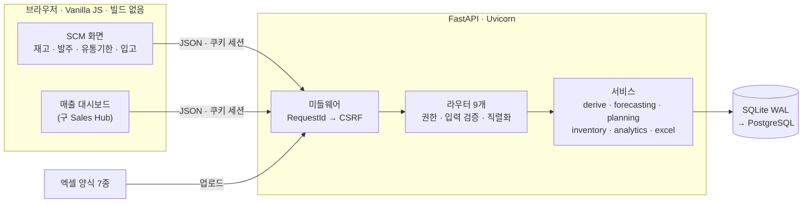

단일 FastAPI 앱이 화면용 API와 계산을 모두 맡는다. 브라우저는 DB(또는 Firebase)에 직접 붙지 않는다.
권한 규칙과 계산 로직을 Python 서비스 계층 한 곳에 두기 위해서다.

### 6.2 계층 규칙

| 계층 | 책임 | 하지 않는 것 |
|---|---|---|
| `routers/` | 권한 가드, 입력 검증(Pydantic), 응답 직렬화 | 계산. v1은 재고 라우터 하나가 849줄이었고 계산이 전부 안에 있었다 |
| `services/` | 업무 계산. dataclass로 결과와 **근거가 되는 중간값**을 함께 반환 | HTTP, 표현(HTML·문구) |
| `services/forecasting.py` | 예측 공식. **순수 함수, DB를 모른다** | DB 접근. 그래서 단위 테스트가 쉽고 입력 출처가 바뀌어도 그대로 쓴다 |
| `models/` | 테이블, 제약조건, 공용 타입 | 업무 흐름 |
| `core/` | 설정, 보안, 의존성, 미들웨어, 날짜 유틸 | 도메인 지식 |

### 6.3 요청 한 건의 경로

```
요청
 → RequestIdMiddleware   요청 ID 부여 (로그 상관관계, 응답 헤더 X-Request-ID)
 → CsrfMiddleware        상태 변경 요청이면 쿠키 토큰 == 헤더 토큰 확인
 → 라우터 의존성          get_current_user (JWT 검증 → DB에서 사용자 재조회) → require_role
 → 핸들러 → 서비스 → DB  get_db: 요청당 세션 하나, 예외 시 rollback
 → 예외 처리기            IntegrityError → 409 · SQLAlchemyError → 500 · 그 외 → 500 (DEBUG일 때만 메시지 노출)
```

미들웨어는 등록 역순으로 실행되므로 `RequestId`를 나중에 등록해 가장 바깥에 둔다. CSRF 거부 로그에도 요청 ID가 찍힌다.

### 6.4 디렉터리

```
eibe/
├── app/
│   ├── __init__.py        stdout/stderr UTF-8 고정 (어떤 모듈보다 먼저 실행)
│   ├── main.py            앱 생성 · lifespan · 예외 처리기 · 라우터 등록
│   ├── config.py          설정 단일 출처 (.env, EIBE_ 접두어, production 검증)
│   ├── database.py        엔진 · 세션. 방언 차이는 여기서만 처리
│   ├── core/              security(JWT·bcrypt·CSRF) · deps(권한 가드) · middleware · dates(ISO 주차) · logging
│   ├── models/            types(금액 타입) · enums · master · scm · sales · metrics · auth
│   ├── schemas/           Pydantic 요청·응답
│   ├── services/          forecasting · derive · planning · inventory · analytics · excel
│   └── routers/           auth · system · master · inventory · pipeline · sales · analytics · files · users
├── alembic/versions/      마이그레이션 2건
├── scripts/               seed_dev(개발 시드, production 거부) · create_admin
├── tests/                 385개
└── docs/                  STATE.md(진행·결정) · patterns.md(겪고 해결한 문제 P-01~P-17)
```

---

## 7. 데이터 모델

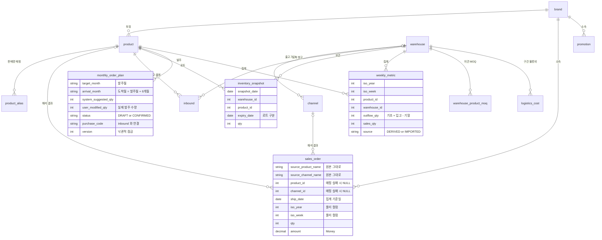

### SCM과 판매를 잇는 접합점은 두 개뿐이다

```
ProductAlias.source_name  →  Product     채널마다 다른 제품 표기("드리미 H12 Pro", "H12PRO 무선청소기")를 품목 하나로
Channel.warehouse_id      →  Warehouse   어느 채널의 판매가 어느 창고 재고를 소진시키는지
```

이 둘만 연결되면 판매 도메인과 SCM 도메인은 서로를 몰라도 된다.

### 모델링 규칙

| 규칙 | 이유 |
|---|---|
| 금액은 `Money = Numeric(15,2)` 등 공용 타입만 | SQLite에는 DECIMAL이 없어 float64를 경유한다. 유효자릿수 15를 넘으면 조용히 반올림된다 (실측: `999999999999999.99` → `1000000000000000.00`) |
| 날짜는 `Date`, ISO 주차는 `iso_year`/`iso_week` 물리 컬럼 | 범위·주차 조회가 인덱스를 타고, 방언별 날짜 함수(`strftime`/`EXTRACT`) 차이를 피한다. 연말 경계(2025-12-29 = 2026-W01)는 표준 라이브러리 `isocalendar()`로 처리 |
| enum은 VARCHAR + CHECK, CHECK 목록은 enum에서 생성 | Postgres 네이티브 ENUM은 값 추가에 `ALTER TYPE`이 필요하고 SQLite엔 없다. 목록을 손으로 두 번 쓰지 않는다. 읽을 때 enum으로 되돌리는 `EnumStr` 타입 |
| 제약조건 이름 규칙(naming convention) | 이름 없는 제약은 Alembic이 되돌릴 수 없고 SQLite batch ALTER도 실패한다 |
| 테이블명 소문자 snake_case | Postgres는 따옴표 없는 식별자를 소문자로 접는다. v1의 `PRODUCT_DB`는 영구히 따옴표가 필요했다 |
| 판매 원장에 원본 문자열 보존 | 매핑이 나중에 생겨도 재업로드 없이 재해석. 미매핑 건이 조용히 사라지지 않고 드러난다 |
| 집계값에 출처(`DERIVED`/`IMPORTED`) | 엑셀로 직접 올린 값은 재계산이 덮어쓰지 않는다 |
| 재고 스냅샷 키에 유통기한 포함 | FEFO는 같은 품목이라도 로트별 잔량이 필요하다 |
| 발주와 발주 계획을 한 테이블로 | 월 1회 발주라 확정된 계획이 곧 주문이다. v1은 같은 사실을 `ORDER_DB`와 `MONTHLY_ORDER_PLAN` 두 곳에 저장했다 |

---

## 8. 핵심 로직 흐름

### 8.1 전체 데이터 흐름

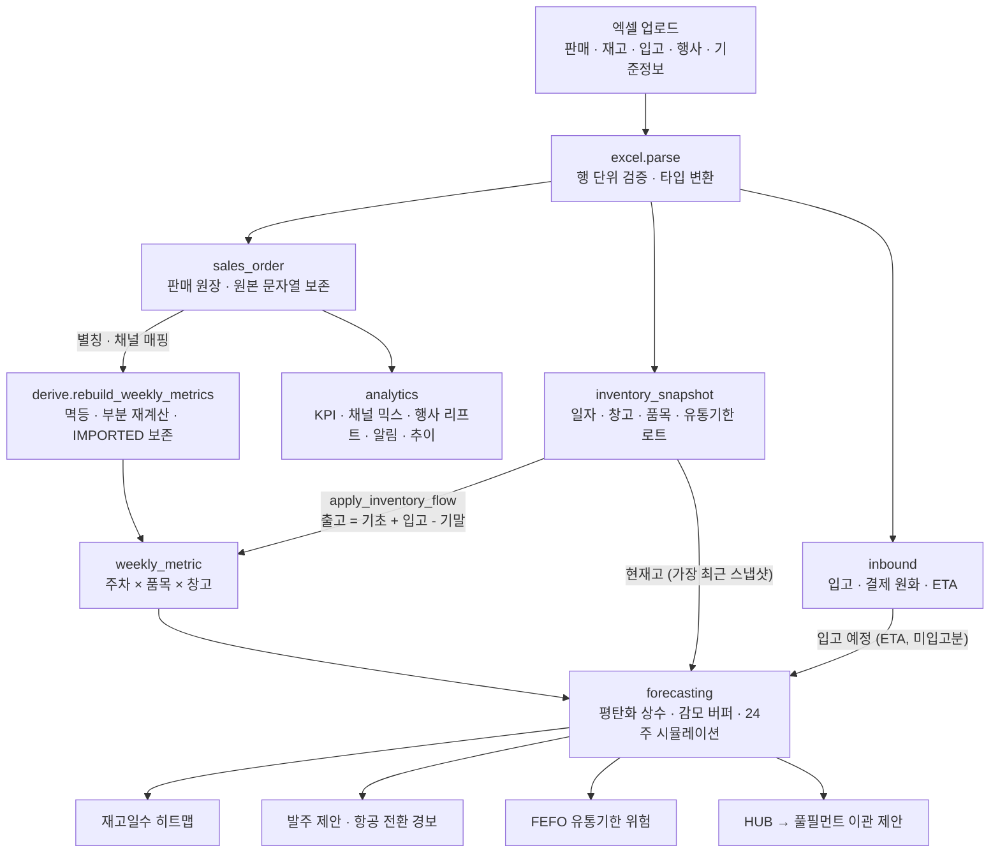

### 8.2 판매 원장 → 주차 집계 (파생)

동기화 job이 아니라 **재계산**이다. 원장이 진실이고 `weekly_metric`은 읽기 쉽게 정리한 사본이다.

1. 재계산 대상 주차를 원장에서 찾는다 (업로드 직후에는 그 파일의 출고일 범위만)
2. 그 주차의 `IMPORTED` 행 키를 먼저 확보한다 (보호 대상)
3. 그 주차의 `DERIVED` 행만 삭제한다 (`synchronize_session="fetch"`, P-15)
4. `sales_order JOIN channel`을 `(iso_year, iso_week, product_id, warehouse_id)`로 GROUP BY해 SQL에서 합산한다
5. 보호 대상과 겹치지 않는 행만 새로 쓴다

지키는 성질은 세 가지다. **멱등**(몇 번 돌려도 같은 결과), **부분성**(특정 주차만), **보존**(손으로 올린 값은 안 건드림).
매핑되지 않은 판매는 어느 창고 재고를 소진시켰는지 알 수 없어 집계에서 빠지고, `/api/sales/unmapped`로 드러난다.

재고 흐름은 스냅샷에서 따로 채운다. `출고량 = 기초재고 + 입고 - 기말재고`. 이때 **스냅샷이 없거나 기초·기말이 같은 스냅샷을
가리키면 건드리지 않는다.** 데이터 없음을 0으로 덮어쓰면 감모 버퍼가 음수로 폭주한다 (P-14에서 실제로 겪었다).

### 8.3 수요 예측과 발주 제안

```
평탄화 상수   S = 최근 12주 출고량의 단순 평균        (데이터가 없는 주는 0으로 채우지 않고 건너뛴다)
감모 버퍼     L = 최근 12주 (출고량 - 판매량)의 평균   (파손·분실·미기록 이관처럼 판매로 설명 안 되는 감소)
주간 수요     D = S × 가중치 + L                     (가중치는 실무자가 조정. 감모에는 곱하지 않는다)

기말재고(W) = 기말재고(W-1) + 입고예정(W) - D        W = 1 … 24
재고일수     = 현재고 / D                            (D ≤ 0 이면 ∞ → 화면에 '소진 불가')
제안 수량    = ⌈ (D × 안전재고 6주 - 기말재고(24)) / 카툰 입수량 ⌉ × 카툰 입수량   (0 이하면 0)
항공 경보    = 기말재고(12) < 0
```

**예시** — 최근 12주 출고 평균 100개, 판매 평균 95개, 현재고 1,500개, 10주 차에 1,200개 입고 예정, 카툰당 24개.

| 단계 | 계산 | 값 |
|---|---|---|
| 감모 버퍼 | 100 - 95 | 5 |
| 주간 수요 | 100 × 1.0 + 5 | 105 |
| 재고일수 | 1,500 / 105 | 14.3주 → **과잉(risk-safe)** |
| 24주 뒤 재고 | 1,500 + 1,200 - 105 × 24 | 180 |
| 목표 안전재고 | 105 × 6 | 630 |
| 제안 수량 | ⌈(630 - 180) / 24⌉ × 24 | **456** |

지금은 과잉인데도 발주가 나온다. 이번 달 주문은 6개월 뒤에 도착하므로, 그 시점 재고(180)가 안전재고(630)에 못 미치기 때문이다.
화면은 발주월(`target_month`)과 도착월(`arrival_month`)을 함께 보여준다.

입고 예정에서 **입고완료 건은 뺀다.** 그 수량은 이미 현재고에 들어 있어서 두 번 세면 재고를 과대평가한다.

### 8.4 재고일수 히트맵

`stock_on(reference)`이 (품목, 창고)별로 **기준일 이전 가장 최근 스냅샷**의 수량과 그 스냅샷 날짜를 돌려준다.
재고 현황·유통기한·이관·발주가 모두 이 함수 하나를 쓴다. 규칙이 두 벌이 되면 화면마다 다른 재고가 보이기 때문이다.

| 재고일수 | 클래스 | 의미 |
|---|---|---|
| < 6주 | `risk-high` | 위험 — 품절 임박 |
| 6 ~ 9주 | `risk-mid` | 주의 — 발주 검토 |
| 9 ~ 13주 | `risk-low` | 양호 — 적정 |
| > 13주 또는 소진율 0 | `risk-safe` | 과잉 — 이관·할인 검토 |

경계값은 `forecasting.RISK_THRESHOLDS_WEEKS` 한 곳에만 있고, enum 값이 곧 CSS 클래스명이다.

### 8.5 유통기한 — FEFO 위험 판정

기한이 이른 로트부터 나간다고 보면, 뒤에 있는 로트는 **앞의 로트가 다 빠진 뒤에야** 소진되기 시작한다.

```
소진 주수(로트) = (앞에 놓인 물량 + 이 로트 수량) / 주간 수요
위험           = 기한 경과  또는  소진 주수 × 7 > 남은 일수
판정 가능      = 기한이 있고 주간 수요 > 0   (아니면 '모름'이지 '안전'이 아니다)
```

예: 주간 수요 50개. 로트 A(30일 남음, 200개)는 200/50 = 4주 = 28일이라 안전. 로트 B(60일 남음, 300개)는
(200+300)/50 = 10주 = 70일이라 **위험**. B만 따로 보면 6주면 다 나가지만 A가 먼저 나가야 한다.

판매 채널이 붙지 않은 HUB처럼 소진 이력이 없는 거점은 위험으로 칠하지 않는다. 근거 없이 빨갛게 칠하면 진짜 위험이 묻힌다.

### 8.6 이관 제안 — HUB → 풀필먼트

1. HUB 창고를 찾는다 (`WarehouseType.HUB`)
2. 모든 (품목, 창고) 재고일수를 계산하고 **재고일수가 낮은 순**으로 정렬한다
3. 거점마다 `부족분 = 주간수요 × 9주 - 현재고`. 소진율 0이거나 부족분이 없으면 건너뛴다
4. MOQ(창고·품목 예외 → 창고 기본값 순)의 배수로 올린다
5. HUB 잔여 재고를 넘지 않게 깎고, 깎였으면 `shortfalls`에 남긴다
6. 구간 물류비 × 카툰 수로 비용을 붙인다 (구간 미등록이면 `None` → 화면 `-`)

목표를 적정(13주)보다 낮은 9주로 잡은 이유: 여유 있는 거점까지 흔들지 않기 위해서다.

### 8.7 엑셀 업로드

```
양식 다운로드 (헤더 + 회색 예시 행)
 → 업로드: 크기 확인(20MB) · 종류별 권한 확인(기준 정보는 관리자)
 → parse: openpyxl read_only · 헤더 이름으로 열 찾기 · 셀 타입 변환 · 예시 행 건너뛰기
          실패한 행은 "몇 번째 줄, 어느 칸, 왜"를 모으고 나머지는 계속 읽는다
 → import: 500행 단위 flush · 판매는 별칭·채널 매핑, 미매핑은 원본 그대로 저장하고 목록 반환
 → 판매 업로드면 올린 출고일 범위의 주차만 재집계
```

셀 변환 세부: 금액은 `Decimal(str(float))`로 바꾼다(`Decimal(0.1)`은 `0.1000000000000000055…`).
날짜는 엑셀 일련번호(기준일 1899-12-30), `datetime`, `2026년 6월 19일`, `26-06-19`, 시간이 붙은 문자열을 모두 받는다.
v1은 pandas가 빈 칸을 `NaN`(float)으로 만들어 셀마다 방어 코드가 붙었고, `except Exception: continue`로 실패 행을 조용히 버렸다.

### 8.8 매출 대시보드

한 번의 호출로 화면 한 장을 채운다. 원장을 한 번 읽고 이후 계산은 메모리에서 한다.

| 지표 | 계산 | 주의한 점 |
|---|---|---|
| 주간 KPI | 이번 주(기준일까지) vs 직전 주 **같은 경과일수** | v1은 수요일에 열면 3일치와 7일치를 비교해 WoW가 늘 폭락으로 보였다 |
| 월간 KPI | 이번 달 1일~기준일 vs 지난달 같은 날까지 (말일은 클램프) | |
| 모멘텀 | 이번 주 vs 직전 완결 4주 평균 | 전주 한 주만 보면 그 주가 특이했는지 알 수 없다 |
| 채널 믹스 | 채널 그룹별 금액 점유율, 변화는 **%p** | 증감률과 점유율 변화는 섞으면 안 되는 값 |
| 포트폴리오 | 월 기준 라인업 성장·하락 상위 3 | 신규는 맨 앞, 사라진 라인업은 -100%로 노출 |
| 행사 리프트 | (행사 기간 일평균 / 직전 14일 일평균 - 1) × 100 | 일평균으로 비교(기간 길이 차이 제거). 기준선 없거나 시작 전이면 `None` |
| 알림 | 라인업 +50% / -25%, 채널 -20%, 채널 +30%(행사 있음) 또는 +50%(행사 없음) | 직전 0인 대상은 제외, 최대 5개, 변화 큰 순. **문구는 만들지 않고 사실만** 반환 |
| 추이 | 주/월 × 수량/금액 × 채널그룹·채널·라인업·품목·카테고리 | 기준일 이후 구간은 만들지 않는다. 계열 120개 초과 시 '기타'로 합침 |

### 8.9 인증과 CSRF

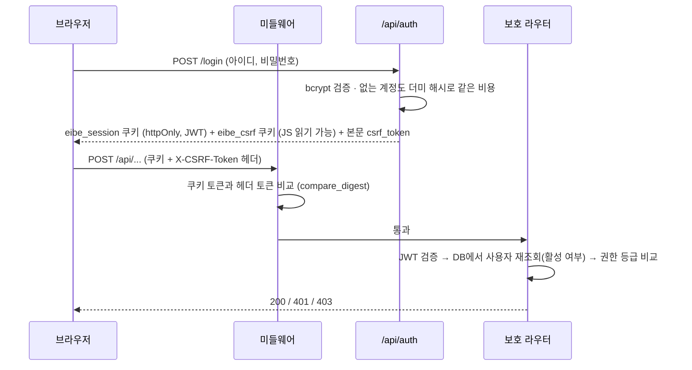

- 세션 토큰은 httpOnly 쿠키라 XSS로 읽을 수 없다. 대신 쿠키는 자동 전송되므로 CSRF를 **이중 제출 쿠키**로 막는다
- 매 요청마다 DB에서 사용자를 다시 읽으므로 비활성화·권한 변경이 즉시 반영된다
- 권한은 `VIEWER < OPERATOR < ADMIN` 순위 비교. 조회는 로그인만, 업무 데이터 변경은 운영자, 기준 정보·사용자는 관리자
- **인증이 기본값**: 보호 라우터에 가드를 걸고, 공개 엔드포인트(헬스체크)는 별도 `public_router`에 둔다.
  FastAPI는 라우터와 라우트 의존성을 합치므로 `dependencies=[]`로는 가드가 풀리지 않는다 (P-01)

---

## 9. API

`/docs`에서 Swagger로 전체를 볼 수 있다 (production에서는 비활성화).

| 접두어 | 라우터 | 엔드포인트 | 기본 권한 | 주요 기능 |
|---|---|---|---|---|
| `/api/system` | system | 2 | 공개 / 관리자 | 헬스체크(공개), 진단 |
| `/api/auth` | auth | 3 | 공개 / 로그인 | 로그인 · 로그아웃 · 내 정보 |
| `/api/users` | users | 4 | 관리자 | 계정 CRUD (삭제 대신 비활성화) |
| `/api/master` | master | 25 | 조회 로그인 · 변경 관리자 | 브랜드 · 품목 · 별칭 · 창고 · 채널 · 물류비 · 이관 MOQ |
| `/api/inventory` | inventory | 6 | 조회 로그인 · 변경 운영자 | 스냅샷 CRUD · `/summary` 히트맵 · `/expiry` · `/transfer-plan` |
| `/api` | pipeline | 9 | 조회 로그인 · 변경 운영자 | 입고 CRUD · `/order-plan/simulation` · 발주 계획 저장·수정·삭제 |
| `/api/sales` | sales | 8 | 조회 로그인 · 변경 운영자 | 판매 등록·삭제 · `/unmapped` · `/resolve` · 행사 |
| `/api/analytics` | analytics | 1 | 로그인 | `/dashboard` 화면 한 장 |
| `/api/excel` | files | 3 | 로그인 · 업로드 운영자 | 양식 목록 · 양식 다운로드 · 업로드 |

---

## 10. 설계 결정

`eibe/docs/STATE.md` 4절의 확정 결정(D1~D17) 요약. 뒤집으려면 근거가 필요하다.

| # | 결정 | 근거 |
|---|---|---|
| D1 | 동기화 대신 파생 | 같은 DB로 합치면 동기화 대상이 없다. 판매 원장 하나에서 SCM 집계를 파생 |
| D2·D13 | SQLite → 관리형 PostgreSQL (Firebase Data Connect 또는 Cloud SQL은 배포 시점에 결정) | 전환 실체는 SQLite→Postgres이고 SQLAlchemy가 흡수한다. 둘 다 Postgres라 코드가 같다 |
| D3 | FastAPI를 앞에 유지 | 브라우저가 DB에 직접 붙으면 3단계 권한을 Security Rules로 표현해야 한다. 계산도 Python에 있다 |
| D4 | 인프로세스 스케줄러 제거 | 인스턴스가 늘면 중복 실행되고 서버리스에서는 돌지 않는다 |
| D5 | 백업 기능 제외 | 관리형 DB의 자동 백업·PITR로 대체 |
| D6 | 정규화 테이블 | 시트 배열을 그대로 저장하지 않는다 |
| D7 | 프레임워크·번들러 없음 | 네이티브 ES Module로 빌드 없이 구동. 사내 유지보수 인력이 도구 체인 없이 고칠 수 있게 |
| D8 | 머신러닝 금지 | 실무자가 숫자를 따라갈 수 있어야 발주 근거가 된다 |
| D9 | httpOnly 쿠키 + CSRF 이중 제출 | localStorage 토큰의 XSS 노출 제거 |
| D10 | 폴더명 `eibe/` | `platform/`은 Python 표준 모듈명이라 import를 가릴 수 있다 |
| D11 | 발주 테이블 하나로 | 확정된 계획이 곧 주문. `purchase_code`로 입고와 연결 |
| D14 | 주간 비교는 같은 경과일수끼리 | 3일 대 7일 비교 제거 |
| D15 | 서비스 출력에 HTML 금지 | 표현 재사용, 업로드된 제품명이 스크립트가 되는 XSS 차단 |
| D16 | '기준선 없음'은 `None` | v1은 `99999`, `-100%`로 채웠다 |
| D17 | pandas 제거, openpyxl만 | 행 단위 읽기에 DataFrame 불필요. `NaN` 방어 코드 제거 |

### v1 → v2에서 바뀐 것

| 영역 | v1 | v2 |
|---|---|---|
| 시크릿 | `SECRET_KEY` 코드에 하드코딩 | `.env` 단일 출처. production에서 32자 미만이면 기동 거부 |
| 초기 관리자 | 서버 기동마다 `admin/admin` 생성 | 환경변수로 명시할 때만. production에서 흔한 비밀번호 거부 |
| 토큰 저장 | `localStorage` | httpOnly 쿠키 + CSRF 토큰 |
| JWT 라이브러리 | python-jose (유지보수 중단) | PyJWT, 알고리즘 고정 |
| 조회 API 인증 | 라우트마다 붙임 → `GET /api/users` 무인증 노출 | 라우터 기본 가드, 공개는 별도 라우터 |
| 금액 · 날짜 | `Float` · `Text` | `Numeric`(정밀도 한계 고정) · `Date` |
| 스키마 관리 | `create_all()` | Alembic (SQLite batch 모드, 왕복 검증) |
| 백업 | APScheduler 인프로세스 스냅샷 | 관리형 DB 백업으로 위임 |
| 로그 | `print()` | `logging` + 요청 ID |
| 엑셀 | pandas + `except: continue` | openpyxl + 행 단위 오류 리포트 |
| 계산 위치 | 라우터 안 (재고 라우터 849줄) | 서비스 계층, 예측은 순수 함수 |
| 테스트 | 서버를 띄워 200만 확인하는 스크립트 | pytest + TestClient 인메모리, 385개 |

---

## 11. 품질 관리

### 테스트

| 파일 | 개수(함수) | 다루는 것 |
|---|---|---|
| `test_forecasting.py` | 39 | 평탄화 · 감모 버퍼 · 시뮬레이션 · MOQ · 항공 경보 · 경계값 |
| `test_analytics.py` | 51 | 기간 계산 · KPI · 채널 믹스 · 포트폴리오 · 행사 리프트 · 알림 · 추이 |
| `test_excel.py` | 32 | 날짜·금액 변환 · 행 단위 오류 · 적재 |
| `test_models.py` | 32 | 제약조건 · 금액 정밀도 한계 · 제약 이름 · 소문자 테이블명 |
| `test_inventory.py` / `test_derive.py` | 26 / 23 | 히트맵 · FEFO · 이관 / 멱등성 · 보존 · 결손 데이터 |
| `test_auth.py` / `test_users.py` | 19 / 20 | 쿠키 · CSRF · 타이밍 · 권한 / 마지막 관리자 보호 |
| 그 외 | | dates(ISO 주차 연말 경계) · master · pipeline · sales API |

파라미터화 포함 실행 기준 385개. 기법:

- **서버 없이 ASGI 앱 직접 호출** — `TestClient`가 lifespan까지 실행하고 쿠키를 들고 다닌다 (P-12)
- **설정 주입 순서** — `conftest.py` 최상단에서 환경변수를 먼저 세팅하고 그 아래에서 app을 import
- **격리** — 매 테스트 후 `rollback()` 먼저, 그다음 FK 역순으로 테이블 비우기 (P-07)
- **규약을 테스트로 강제** — 제약조건 이름 누락, 대문자 테이블명, 금액 정밀도 한계가 테스트로 막힌다
- **실데이터로 전 구간** — 단위 테스트 141개가 다 통과한 상태에서 시드로 돌려 음수 수요를 발견한 경험(P-14) 이후,
  기능이 끝나면 시드 데이터로 파이프라인을 끝까지 돌리고 숫자가 상식적인지 눈으로 본다

### 겪고 해결한 문제 아카이브

`eibe/docs/patterns.md`에 **실제로 겪고 측정해서 해결한 것만** 증상·원인·해결·적용 범위로 남긴다. 예방 차원의 일반론은 넣지 않는다.

| ID | 내용 |
|---|---|
| P-01 | FastAPI 라우터 의존성은 해제되지 않는다 → 공개 라우터 분리 |
| P-02 | SQLite 금액 정밀도는 유효자릿수 15가 한계 |
| P-03 · P-04 | 한국어 Windows cp949 — 외부 도구가 읽는 파일은 ASCII, 콘솔 UTF-8은 패키지 진입점에서 |
| P-05 · P-06 · P-09 · P-10 | 제약 이름 규칙, 소문자 테이블명, enum에서 CHECK 생성, Date와 주차 물리 컬럼 |
| P-07 | 제약 위반 테스트 뒤에는 롤백이 먼저 (무관한 테스트 9개 연쇄 실패) |
| P-08 · P-17 | 시드는 멱등하게, 그리고 기능의 정상 경로를 지나가게 (행사 3건이 -100%로 보였던 일) |
| P-11 | 동기화 대신 단일 원장에서 파생 |
| P-12 · P-13 | 서버 없이 ASGI 호출, 로그인 실패 응답 시간 맞추기 |
| P-14 | 파이프라인은 실데이터로 끝까지 — 결손 데이터를 0으로 덮어 음수 수요 |
| P-15 | 벌크 삭제는 세션 아이덴티티 맵을 정리한다 |
| P-16 | 인수인계 문서는 빈 클론에서 한 줄씩 실행해 검증한다 |

### AI 개발 하네스

코드 변경은 메인 세션(PM)이 요구를 계약서(`.squad/contracts/T-###.md`)로 바꾸고, 영역별 에이전트(front · back · data)가 구현하는 방식으로 진행한다.

| 장치 | 역할 |
|---|---|
| 작업 크기 판정 S/M/L | S는 PM이 직접, M은 계약 → 담당 에이전트 → 검증, L은 조사 → 사용자 승인 → data → back → front |
| 계약서 `allowed_files` | 에이전트가 손댈 수 있는 파일 범위를 미리 정한다 |
| 훅 (`scripts/hooks/`) | 위험 명령 차단(`guard`), 파일 수정 직후 정적 검사(`post_edit`), 턴 종료 시 전체 검증(`stop_gate`, 3회 연속 실패 시 사용자 보고) |
| reviewer / police | 앱을 실제로 조작해 채점하는 QA와 계약·룰 준수 감사. **빌더와 다른 모델 계열(Codex)** 로 교차 검증 |
| `resume` 스킬 · `이전현황.md` | 여러 PC에서 같은 상태로 이어서 작업하기 위한 인계 기록 |

현재 하네스의 검사 경로는 v1 기준이라 `eibe/` 변경을 검사하지 않는다. eibe 기준으로 옮기는 작업이 남아 있다 (13절).

---

## 12. 실행 방법

### v2 (`eibe/`)

```bash
cd eibe
python -m venv .venv
.venv/Scripts/python.exe -m pip install -r requirements.txt
cp .env.example .env            # EIBE_SECRET_KEY를 비워두면 임시 키 생성 (재시작마다 세션 만료, 로컬은 무방)
.venv/Scripts/python.exe -m alembic upgrade head
.venv/Scripts/python.exe -m scripts.seed_dev          # 개발 계정 + 샘플 데이터 (production에서는 실행 거부)
.venv/Scripts/python.exe -m pytest                    # 385개 중 380개 통과가 현재 기준
.venv/Scripts/python.exe -m uvicorn app.main:app --port 8000
```

개발 계정: `admin` / `operator` / `viewer`, 비밀번호 모두 `dev-password-1234`. API 문서는 `http://localhost:8000/docs`.

PostgreSQL로 옮길 때는 `.env`의 `EIBE_DATABASE_URL=postgresql+psycopg://...` 한 줄과 `requirements.txt`의 psycopg 주석 해제만 바뀐다.

### v1 (루트)

```bash
python -m venv venv
venv\Scripts\python -m pip install -r requirements.txt
venv\Scripts\python seed_data.py                     # 기존 데이터 삭제 후 샘플 생성
venv\Scripts\python -m uvicorn app.main:app --port 8000
```

API가 응답하지 않으면 코드를 보기 전에 포트를 잡고 있는 **좀비 uvicorn 프로세스**부터 종료한다.

---

## 13. 알려진 문제와 로드맵

괄호 안 번호는 `이전현황.md` 4절의 항목 번호다.

| # | 문제 | 상태 |
|---|---|---|
| 1 (K1) | 매출 대시보드 API 500 — `vars()`를 `slots=True` dataclass에 사용 (`routers/analytics.py:194`). 테스트 4건 실패 | 원인 확인, 수정 예정 |
| 2 (K2) | `/api/sales/resolve`가 새 매핑이 있을 때만 재집계. 테스트와 docstring은 항상 재집계를 기대. 테스트 1건 실패 | 원인 확인, 수정 예정 |
| 3 (신규) | 판매 삭제 시 집계가 남는다 — 삭제 후 재집계 대상을 "그 출고일에 남은 주문"으로 찾기 때문에 같은 날 다른 주문이 없으면 대상이 비어 `weekly_metric`이 그대로 남는다. 2번을 고쳐도 같은 테스트가 이 지점에서 다시 실패한다 (2026-10-08 재현) | 원인 확인 |
| 4 (신규) | 재고 흐름(`apply_inventory_flow`)이 시드 스크립트에서만 호출된다. API 경로에서는 출고량 = 판매량이라 감모 버퍼가 0이 되고, 판매 재집계가 이미 채운 재고 흐름 값을 지운다 | 설계 보완 필요 |
| 5 (신규) | 자산 평가(입고 실결제 원화 역추적)는 v1에만 있고 v2에는 아직 없다. 컬럼(`payment_amount_krw`)만 준비됨 | Phase 5~6 |
| 6 (K3~K5, K8) | AI 하네스·규칙 문서가 v1 기준. `eibe/` 변경을 훅이 검사하지 않는다 | 이전현황 5절 2~3번 |
| 7 (신규) | 발주 계획 낙관적 잠금이 "읽고 비교한 뒤 쓰기"라 동시 요청 사이에 틈이 있다. SQLAlchemy `version_id_col`로 `UPDATE … WHERE version = ?`가 되게 바꾸는 것이 맞다 | 개선 후보 |

다음 순서: 실패 테스트 수정 → 하네스를 eibe 기준으로 전환 → Phase 5 프론트엔드 통합 → Phase 6 시딩·테스트 → Phase 7 루트 승격.

---

## 14. 문서 지도

| 문서 | 내용 |
|---|---|
| [`eibe/docs/STATE.md`](eibe/docs/STATE.md) | v2 진행 상황 · 로드맵 · 확정 결정 D1~D17 · 규약 |
| [`eibe/docs/patterns.md`](eibe/docs/patterns.md) | 겪고 해결한 문제 P-01~P-17 |
| [`docs/interview-qa.md`](docs/interview-qa.md) | 이 프로젝트에 대한 예상 질문과 답변 |
| [`docs/spec.md`](docs/spec.md) | v1 기획 명세 |
| [`docs/history.md`](docs/history.md) | v1 장애·개선 이력 |
| [`이전현황.md`](이전현황.md) | 기기 간 인계 기록, 다음 할 일 |
| [`AGENTS.md`](AGENTS.md) · [`CLAUDE.md`](CLAUDE.md) | AI 에이전트 작업 규칙 |
